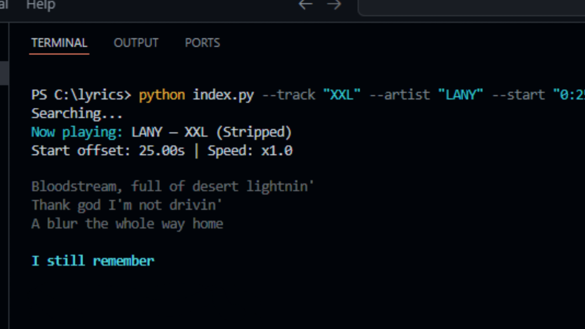

# 🎶 Python Terminal Live Lyrics Viewer

A sleek Python CLI tool that displays **synchronized lyrics** (from [lrclib.net](https://lrclib.net)) directly in your terminal with smooth typing animation, dynamic coloring, and live timing.

---

## 📍 Features

- 🎧 Fetches synced lyrics from **lrclib.net** automatically  
- 🕐 Perfectly timed display according to `.lrc` timestamps  
- ⌨️ Smooth **typewriter effect** with customizable speed  
- 🌈 ANSI-colored text and blinking cursor effects  
- ⏩ Adjustable playback speed & start time

---

## ✨ Support

If you like this project, please star on this repository, thank you ⭐<br>
You can support me by:<br>
<a href="https://trakteer.id/abdipr" target="_blank"></a>
<a href="https://saweria.co/abdipr" target="_blank"></a>
<a href="https://www.buymeacoffee.com/abdipr" target="_blank"></a>

---

## 📦 Installation

1. **Install Python 3.8+**

   Download from [python.org/downloads](https://www.python.org/downloads/).  
   Make sure to check ✅ **“Add Python to PATH”** during setup.

   Verify the installation:
   ```bash
   python --version
   ```

2. **(Optional) Install `requests`**

   ```bash
   pip install requests
   ```

   > If you don’t install `requests`, the script will automatically fall back to Python’s built-in `urllib`.

3. **Clone this repository**

   ```bash
   git clone https://github.com/abdipr/python-lyrics.git
   cd python-lyrics
   ```

---

## 🚀 Usage

Basic command:

```bash
python main.py --track "Song Name" --artist "Artist Name"
```

Example:

```bash
python main.py --track "XXL" --artist "LANY"
```

Start playback from a specific time:

```bash
python main.py --track "XXL" --artist "LANY" --start 0:30
```

Speed up or slow down lyric timing:

```bash
python main.py --track "XXL" --artist "LANY" --speed 1.25
```

---

## ⚙️ Command Line Options

| Option     | Description                      | Example          |
| ---------- | -------------------------------- | ---------------- |
| `--track`  | Track title *(required)*         | `--track "ILYSB"`|
| `--artist` | Artist name *(optional)*         | `--artist "LANY"`|
| `--start`  | Start time in `mm:ss` or seconds | `--start "1:20"` |
| `--speed`  | Playback speed multiplier        | `--speed 0.8`    |

---

## 🧠 How It Works

1. The script queries [lrclib.net](https://lrclib.net) for a song’s synced lyrics.
2. It parses `[mm:ss.xx]` timestamps from the LRC format.
3. Each lyric line appears at the correct time, letter-by-letter, with color and cursor animation.
4. Past lines are dimmed, while the active line is displayed brightly in cyan.

---

## 🖥️ Demo

```
Now playing: LANY — XXL
Start offset: 0.00s | Speed: x1.0

    Bloodstream full of desert lightnin'
    Thank God I'm not drivin'
    A blur the whole way home

    I still remember █
```

---

## 🪶 Example Output (Static Preview)



---

## 🧰 Tech Stack

* **Python 3.8+**
* `requests` *(optional)*
* ANSI escape codes for color and cursor control
* CLI-based UX with `argparse`

---

## 🛠️ File Structure

```
python-lyrics/
├── main.py           # Main executable script
├── README.md         # Documentation
└── snapshot.png      # Example screenshot
```

---

## ❤️ Credits

* Lyrics data: [lrclib.net](https://lrclib.net)
* Terminal color codes inspired by classic Linux CLI tools

---

## 📜 License

This project is licensed under the **MIT License** — feel free to modify and distribute.<br>Made with ☕ and 🎧 by [abdipr](https://github.com/abdipr).